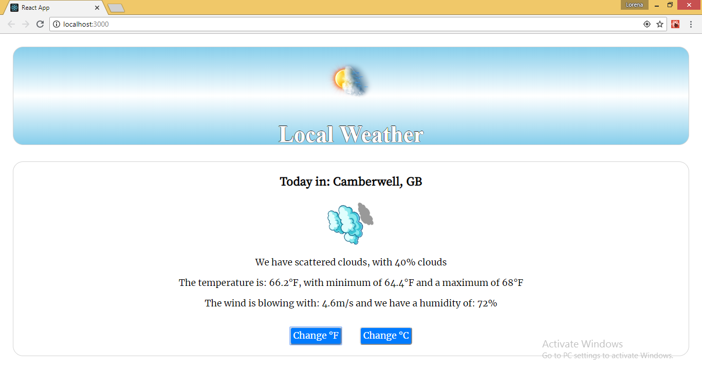

# Get Weather App

A project in React that is taking the user location and shows the weather in that location. The user will find out what is the description of the weather, the humidity, chances of rain, wind, temperature and he will also be able to change the temperature from Fahrenheit to Celsiuse.

## Screenshots

Weather App before the API Call is made:


Weather App after the API call is made:


Weather App with the temperature in Fahrenheit:



## To start the project:

 * Install and start the app:

    - ```clone the repo```
    - ```cd into the folder```
    - ```run npm install```
    - ```npm start```

#### To see the game online: https://get-weather-app.herokuapp.com/

## Extra info:

#### Testing
console.log(wrapper.debug()); - print a wrapper react component in the terminal; while running Jest
git commit --amend - changes the git commit message

   